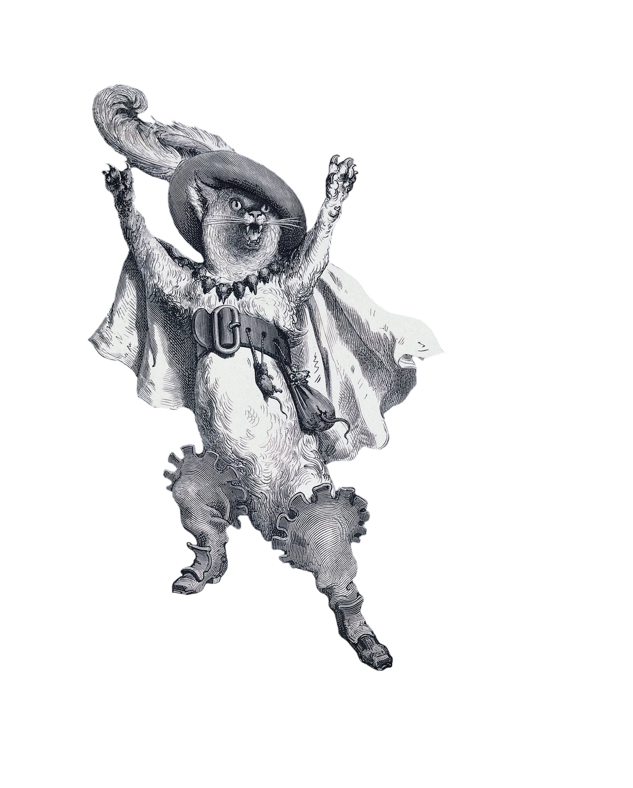

<p align="center">
  
</p>

# Gustave Doré Character Cutouts 


This project aims to collect and share cut-out characters extracted from illustrations by **Gustave Doré**.

The goal is to make isolated characters easier to reuse for artistic, educational, game design, collage, research, or creative projects.

## Important Notice About AI Cutouts

**IMPORTANT: most, if not all, of the cutouts in this repository were made using AI.**

**This means the cut-out process may have added details, removed details, altered shapes, changed textures, or otherwise modified the original artwork.**

**These files should not be considered faithful restorations or exact reproductions of Gustave Doré’s original illustrations. They are AI-assisted extractions.**

Each file should clearly indicate whether the cutout was made:

- **by AI**
- **by hand**

If you want to improve the quality of the cutouts manually, **pull requests are very welcome**.

**Hand-made cutouts are strongly encouraged.**  
If you want to replace or improve an AI-generated cutout with a careful manual version, please open a pull request.

## File Status

Each file must specify its cutout method.

```
/
├── originals/
│   └── source images or references
├── cutouts/
│   ├── ai/
│   │   └── AI-generated cutouts
│   └── manual/
│       └── hand-made cutouts
└── README.md
```
